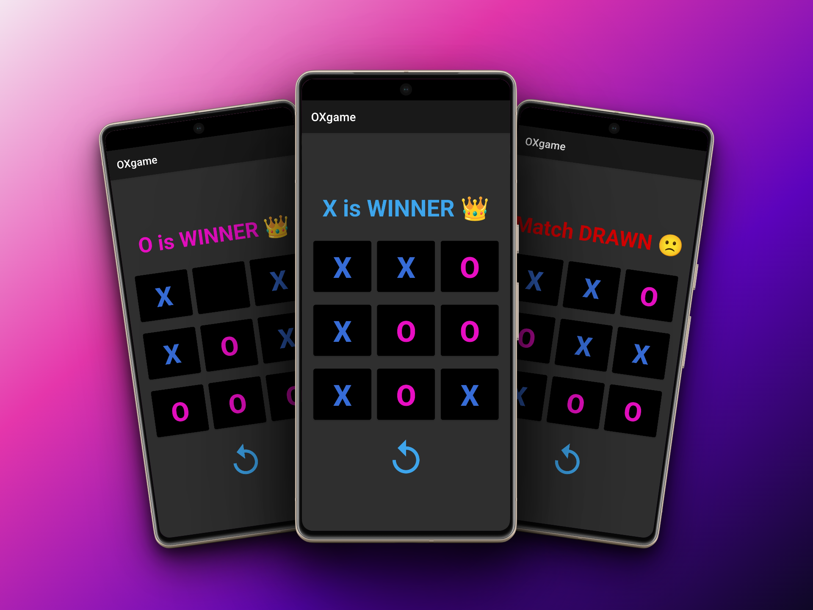

# Tic-Tac-Toe Game

Welcome to the Tic-Tac-Toe Game! This Android application brings the classic game of Tic-Tac-Toe to your fingertips. Challenge yourself against an AI opponent or compete with friends in multiplayer mode. Download now and experience the joy of strategic gameplay!



## Features

- User-friendly interface: Enjoy a sleek and intuitive interface designed for seamless gameplay.
- Single-player and multiplayer modes: Play against the AI or challenge your friends for some friendly competition.
- Interactive gameplay: Tap the desired positions on the grid to make your moves with ease.

## Technologies Used

- Java: Primary programming language for Android app development.
- Android Studio: Powerful IDE for developing Android applications.
- XML: Used for designing the app's layout and UI elements.

## Get the App

Download the Tic-Tac-Toe Game from the Google Play Store and start playing today!

[](https://play.google.com/store/apps/details?id=com.tejraj.oxgame)

## Getting Started

To get started with the Tic-Tac-Toe Game, follow these steps:

1. Clone the repository to your local machine:

    ```
    git clone https://github.com/your-username/tic-tac-toe.git
    ```

2. Open the project in Android Studio.

3. Build and run the project on an Android emulator or a physical device.

4. Start playing the game and enjoy!

## Contributing

Contributions are welcome! If you'd like to contribute to this project, please follow these steps:

1. Fork the repository.

2. Create a new branch for your feature or bug fix.

3. Make the necessary changes in your branch.

4. Test your changes thoroughly.

5. Commit and push your changes to your forked repository.

6. Submit a pull request, explaining the changes you've made and their benefits.

## License

This project is licensed under the MIT License. See the [LICENSE](LICENSE) file for details.

## Acknowledgments

I would like to express my gratitude to [mention names/organizations] for their tutorials and documentation, which were instrumental in my learning process.

## Contact

For any questions, suggestions, or collaborations, feel free to reach out to me on [LinkedIn](https://www.linkedin.com/in/yourname/). Let's connect and discuss exciting ideas!

Stay tuned for updates and more games to come. Your feedback and support are highly appreciated!
